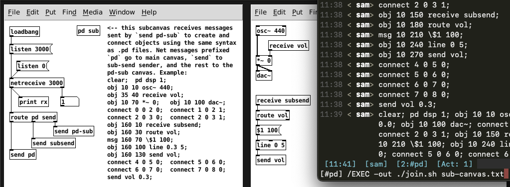

<!-- Copyright (c) 2022 Sam Blenny -->
<!-- SPDX-License-Identifier: MIT -->

# Pdbridge

This is an experimental work in progress to explore ideas about connecting
Markab VM instances to Pure Data (Pd "vanilla") using a network bridge.

Pd is great to build DSP patches for audio synthesis, effects, and software
instruments for live performance with midi or OSC. But, Pd's graphical
programming is not as well suited for sequencing or working with loops,
patterns, and higher level abstractions. People do it, but the workflow is
acutely awkward.

I want to experiment with controlling Pd with using an interface that is more
suitable for orchestrating combinations of higher level patterns. I've got this
image in my head of a music live-coding thing where a band of Markab bots and I
are hanging out with Pd in an IRC channel.
